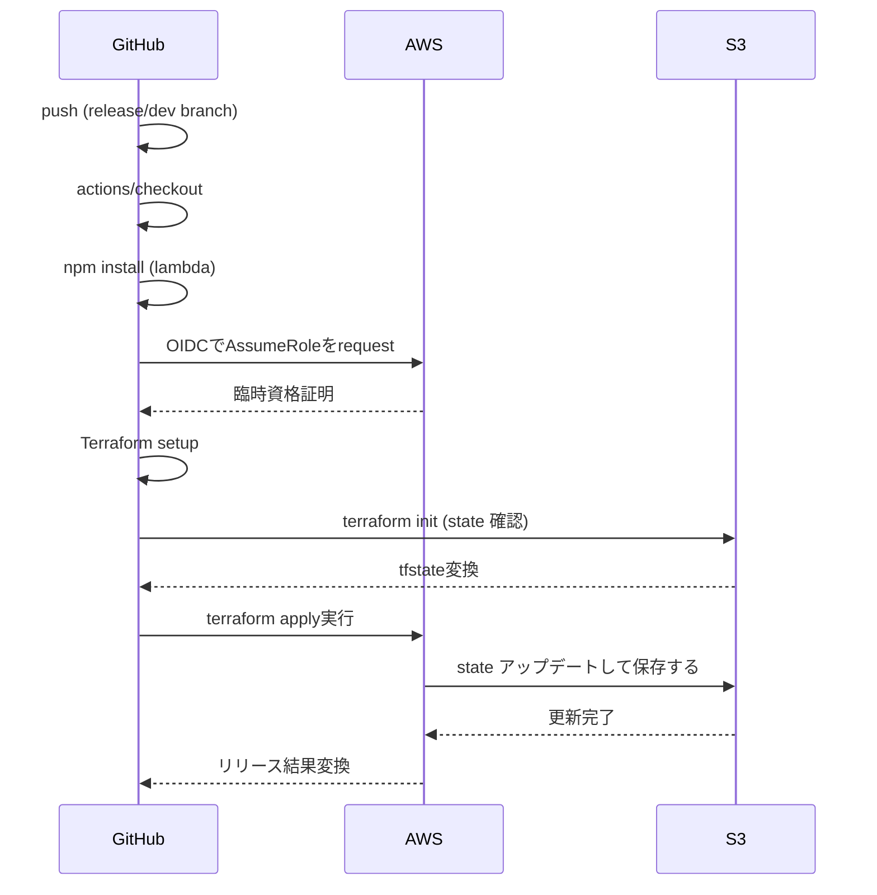
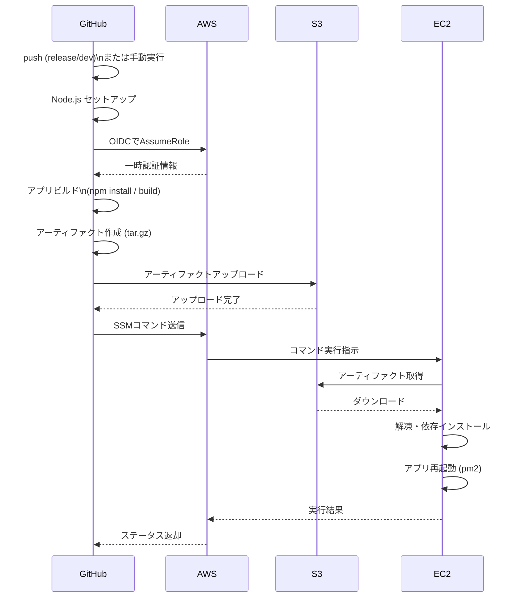
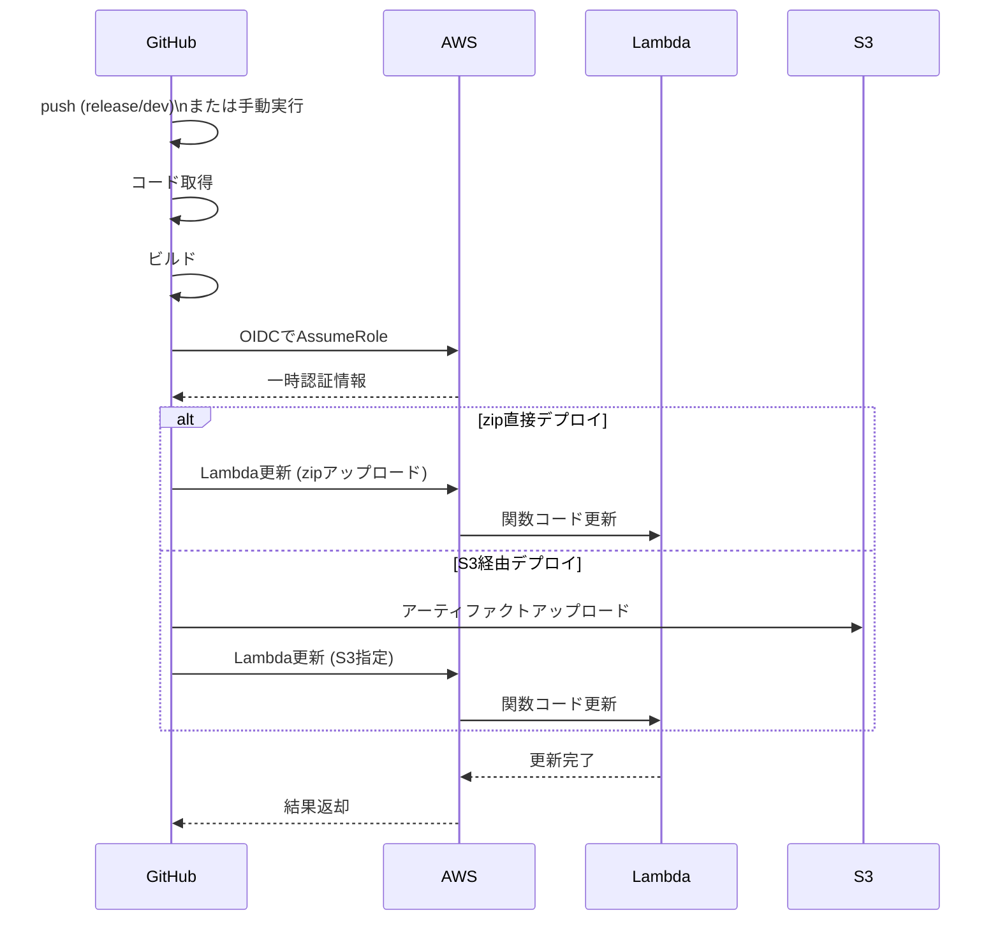

## githubとAWSの結合



## terraform init（初期化）

### 一言でいうと：👉 Terraformを実行するための準備

- 主な処理
  - Provider（例：AWS）のダウンロード
  - Backend（State保存先）の設定
  - .terraform ディレクトリの作成
  - Stateファイルの場所を決定
  - 上記の処理の場合terraform init \
    - -backend-config="bucket=terraform-state-kayanuma" \
    - -backend-config="key=dev/terraform.tfstate" \
    - -backend-config="region=ap-northeast-1"
    - 意味は：
      - S3バケットにStateを保存
      - dev/terraform.tfstate を使う
      - リージョンは東京
- 👉つまり「今後の状態管理はローカルではなくS3でやる」宣言
### 重要ポイント
- ❌ AWSリソースは作られない
- ❌ インフラ変更は一切しない
- ⭕ 何回実行しても問題ない

## terraform apply（適用）

### 一言でいうと：👉 実際にAWSのリソースを作成・変更する

- 内部の流れ
  - 現在のStateを取得（S3）
  - .tfコードと比較
  - 差分（diff）を計算
  - AWS APIを呼び出して変更
  - 結果をStateに保存

## LabmdaやEC2にリリースする開発資材の管理方法
### EC2の場合

### lambdaの場合

```
name: Deploy Lambda (DEV)

on:
  push:
    branches:
      - release/dev

permissions:
  id-token: write
  contents: read

jobs:
  deploy:
    runs-on: ubuntu-latest

    steps:
      - name: Checkout
        uses: actions/checkout@v4

      - name: Install dependencies
        run: |
          npm install --omit=dev

      - name: Zip package
        run: |
          zip -r function.zip .

      - name: Configure AWS credentials
        uses: aws-actions/configure-aws-credentials@v4
        with:
          role-to-assume: arn:aws:iam::${{ secrets.AWS_ACCOUNT_ID }}:role/from_terraform_access_role
          aws-region: ap-northeast-1

      - name: Deploy to Lambda
        run: |
          aws lambda update-function-code \
            --function-name my-lambda-function \
            --zip-file fileb://function.zip
```